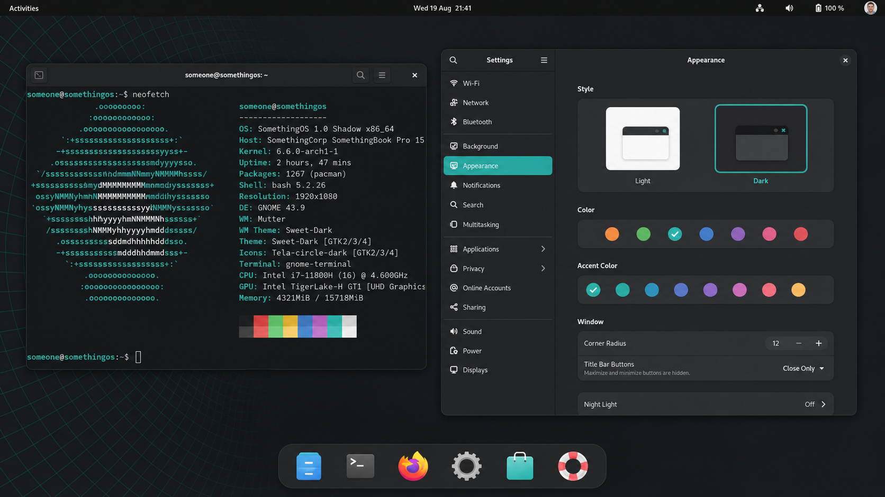

# somethingos

**Debian 12, GNOME Shadow, opsec level infinite.**

SomethingOS is a real operating system: a live, installable remix of
[Debian](https://www.debian.org/) bookworm. Not a theme pack. Not an
Ubuntu reskin. The archive, the kernel, the installer payload — Debian.

The default session is **GNOME Shadow**. **Plasma Shadow** is the other
official flavour. XFCE is not shipped.

```
make iso                 # GNOME Shadow live ISO
make iso DESKTOP=plasma  # Plasma Shadow live ISO
```

<p align="center">
  
</p>

## What it is

| | |
| --- | --- |
| Upstream | Debian 12 *bookworm* only |
| Kernel | Debian `linux-image-amd64` |
| Default desktop | GNOME 43 + dash-to-dock, Adwaita dark, cyan |
| Other desktop | Plasma 5.27, Breeze Dark, same palette |
| Installer | Calamares, SomethingOS branded |
| Live user | `someone` @ `somethingos` |
| Fetch | `neofetch` with a custom mark, first prompt |
| Control | `something status` · `something harden` · `something fetch` |

Hardened sysctl, UFW on, AppArmor on, randomised Wi-Fi MAC, Firefox ESR
with telemetry locked to `https://nothing.weforgot/v1/sink` (that name is
`0.0.0.0` in `/etc/hosts`), **uBlock Origin** force-installed, WireGuard
+ OpenVPN on the image, and a hedgehog runner named Ring Rush.
`something sonic` opens a random unofficial Sonic picture.

Details in [`docs/HARDENING.md`](docs/HARDENING.md).

## Build a USB you can boot

On **Fedora** (or anything that is not Debian): do not install live-build.
Use GitHub Actions — **SomethingOS ISO** → Run workflow — or:

```
sudo dnf install podman
make iso-container
```

On a Debian host:

```
sudo apt-get install live-build debootstrap squashfs-tools \
    xorriso isolinux syslinux-common

git clone <repo> && cd somethingos
make iso
sudo cp somethingos-1.0.0-shadow-gnome-amd64.iso /dev/sdX
```

Full notes: [`docs/BUILD.md`](docs/BUILD.md). Desktops:
[`docs/DESKTOP.md`](docs/DESKTOP.md). Workflow: [`.github/workflows/iso.yml`](.github/workflows/iso.yml).

## The two sessions

```
DESKTOP=gnome    GNOME Shadow   (default, the one in the screenshot)
DESKTOP=plasma   Plasma Shadow  (same OS, KDE stack)
```

Pick at build time. One ISO, one desktop — on purpose.

## `something`

```
something status     hardening posture
something harden     re-apply defaults (root)
something update     Debian security
something fetch      neofetch, SomethingOS ascii
something desktop    which flavour this image is
something about
```

Open a terminal on the live system. neofetch runs once per session;
`fetch` runs it again.

## Tree

```
auto/ config/ hooks     live-build
scripts/something       shipped as /usr/bin/something
config/includes.chroot  rootfs overlay (os-release, dconf, sysctl, …)
branding/               mark, wallpaper, grub
website/                product page + browser Shadow session
docs/
```

## License

SomethingOS original work is GPL-3.0-or-later. Debian packages keep
their own licenses. Not affiliated with the Debian Project.

Opsec level: INFINITE
